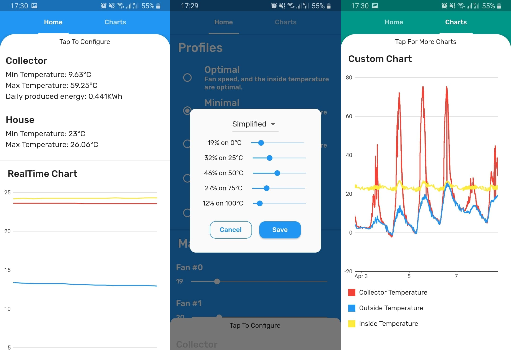

# Collector app
An app to visualize sensor data and configure a smart solar collector.

## Features
- The app displays daily statistics and charts on the screen.
- The IOT device can be remote configured using the app, the user can use pre-made heating profiles or create custom ones.

## Screenshots
- Daily statistics screen, configuration screen, chart screen

## How to build the app
- Install [Flutter](https://docs.flutter.dev/get-started/install)
- Install [Android Studio](https://developer.android.com/studio) (not necessary, but highly recommended)
- Clone the repo
```shell
git clone https://github.com/Isti01/hokollektor.git
```
- Restore project files and install packages
```shell
flutter create .
flutter pub get
```
- Install an [Android emulator](https://developer.android.com/studio/run/managing-avds) and run the app.
```shell
flutter run
```